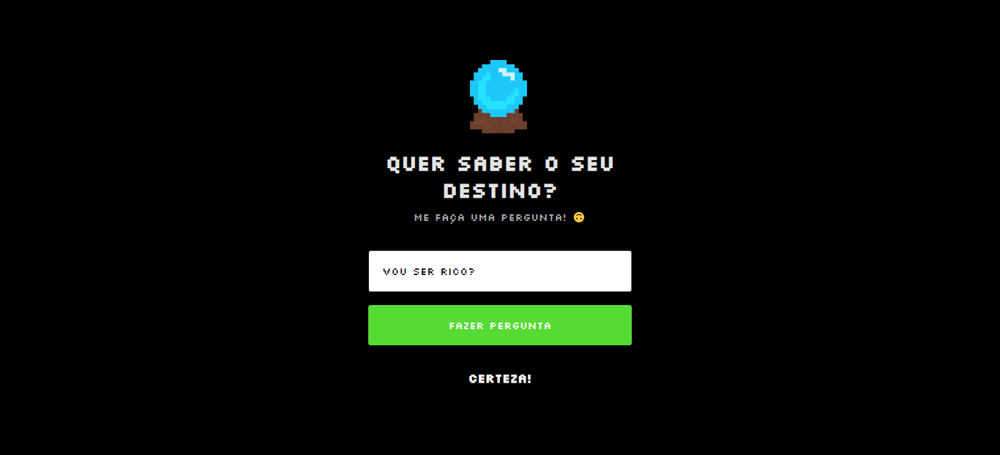

<h1 align="center"> JOGO PERGUNTAS </h1>

Versão 2.0

 

  

### 🚀 Tecnologias

Desenvolvido com:

- HTML e CSS
- JavaScript

### 💻 Projeto

Jogo para responder perguntas.

### 🖱️ Visite

https://jonathafernandes.github.io/jogo-perguntas/
